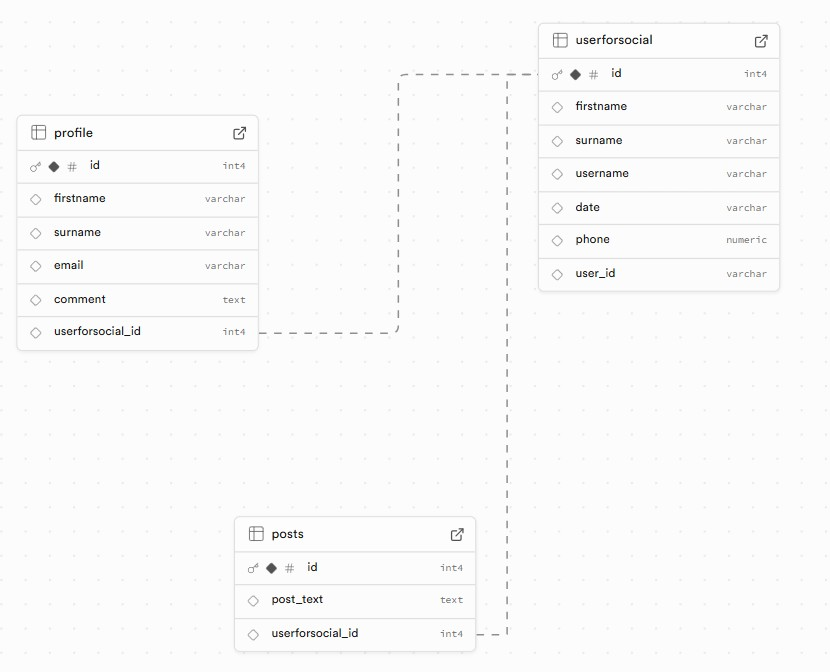
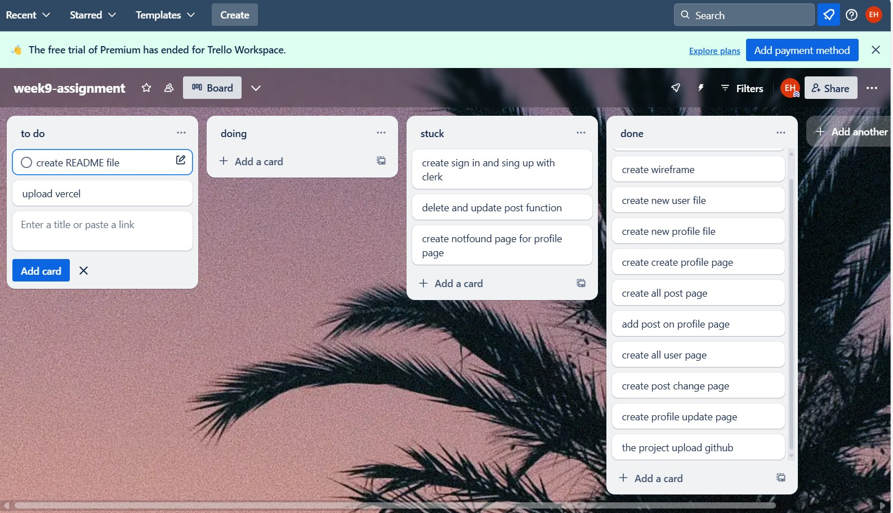

Project name: Social Network

Vercel link: week9-assignment-ten.vercel.app

Repo link: https://github.com/eminehorozoglu/week9-assignment

Project description:

A website that is completely yours. You must first register on the site. If you are not registered, you cannot enter the profile page.

After registering as a user on the site, you will be directed to a new user registration. After entering your information here, you will be directed to the page where you will create your profile. After registering here, you will have created your own profile page.

After logging in to the site, you can share any post you want on the my profile page. If you want, you can update your profile data.

You can see the profiles of all users registered on the site on the all user profile page.

You can access the posts shared by all users on the all post page.

If you want to change or delete the posts you have shared, you can make the desired change by using the change or delete posts button under the relevant post on the my profile page.

Databese on Supabase:

My Project Plan :

Reflections:

1- After signing up with clerk, it took me a while to find the page I wanted to assign.

2-Normally, I created the database files after making a plan. But in this project, I created the sql tables step by step. After creating the sql table, I created the java codes. I proceeded step by step by doing this for each page.#

3-I couldn't create a wireframe because I wasn't sure what exactly I wanted to show on the sql tables and page. The pages formed in my head as I created them.

4-I had difficulty creating queries for the sql tables and connecting them to each other.

5-I tried to make a form with radix, but it was difficult for me and made the simple menu with radix.

6-I used a motion effect for the home page.

7-I didn't use many styles because I didn't have enough time. I just used tailwind.

8-If I had time, I would have added comments to the posts, but I couldn't because I ran out of time.

